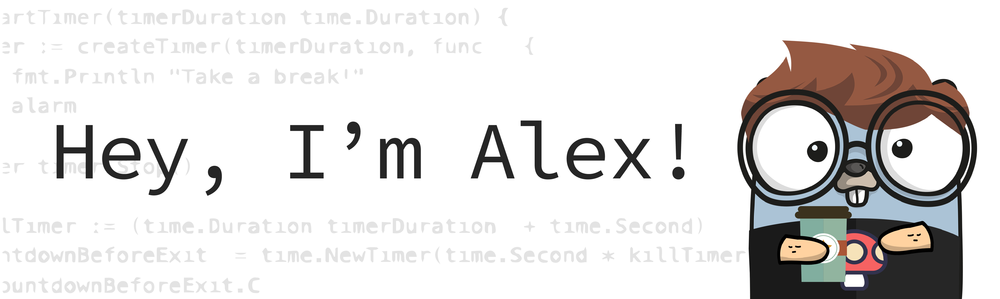

<link href="styles.css" rel="stylesheet"></link>

 Hey, I’m Alex! I graduated from Dominican University with a B.S. in Applied Computer Science and had the chance to live in Silicon Valley for a while. Now, I’m a Software Engineer at a cool startup called Forecastr. I’ve worked on a variety of projects, from building apps with Next.js to helping develop a complex calculations engine. While I’m comfortable with a lot of different technologies, I’m most at home with JavaScript and Python.

## ✨adgray09✨

- 🔭 My interests include: video games, reading, programming, going on nature walks, being lazy with my cat
- 👯 Reach out to me if you're interested in remote education or exploring how to innovate the education system!
-  📫 How to reach me: <a href="https://www.linkedin.com/in/alexander-gray-42b439193"> Linkedin</a> or <a> adgray29@gmail.com</a>
- ⚡ Fun fact: I played Saxophone all throughout middle and high school

<h3  align="left">Languages and Tools:</h3>

                  

